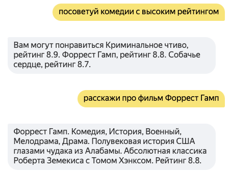

# Навык Кинотеатр Практикума

## Как развернуть навык в Облаке и Диалогах

1. В [Яндекс.Облаке](https://console.cloud.yandex.ru/) 
следуя [инструкции](https://cloud.yandex.ru/docs/functions/quickstart/function-quickstart), 
создать функцию на `Python / 3.9`
1. В редакторе кода этой функции создать и заполнить файлы `main.py`, `movies.py`,
`phrases.py` и `requirements.txt`, а также все файлы из папки `api` либо
загрузить все файлы с помощью zip-архива.
1. В поле "Точка входа" в редакторе функции ввести `main.handler`.
1. В [консоли разработчика навыков](https://dialogs.yandex.ru/developer/)
создать новый навык, выбрав в качестве бэкенда "Функция в Яндекс.Облаке" и 
указав созданную вами функцию. Нужно также поставить галочку "Использовать хранилище данных в навыке".
1. На вкладке "Интенты" нужно добавить 8 интентов из папки grammars. 
В каждом из них нужно ввести название и id, равные имени файлов `.grammar` 
(без расширения) а в поле "грамматика" скопировать содержимое этого файла. 
Подробнее про интенты и сущности можно почитать в 
[документации](https://yandex.ru/dev/dialogs/alice/doc/nlu-docpage/).
7. На этой же подвкладке "Интенты" под заголовком "Сущности" надо нажать 
"Редактировать". В открывшееся окно скопируйте содержимое файла `grammars/genres.vocab`.
8. Всё готово! Вы можете протестировать навык во вкладке "тестирование".    

## Возможности голосового ассистента

Для активации скажите "Запусти навык Тестируем Диплом".

### Порекомендовать кино с высоким рейтингом или определенного жанра:
Примеры вопросов:
* Найди лучшие фильмы
* Порекомендуй кино
* Подскажи аниме с высоким рейтингом
* Какие ты знаешь фильмы в жанре фантастика
* Посоветуй комедию

Алиса назовет 3 фильма и их рейтинг, можно попросить продолжить список, для этого скажите:
* Еще
* Продолжай
* Дальше

### Рассказать о фильме

Попросите Алису рассказать про определенный фильм:

* Расскажи про Небесный замок Лапута
* Найди информацию о фильме Криминальное чтиво
* Расскажи о фильме Брат

Алиса назовет жанр, короткое описание и рейтинг фильма.

### Назвать режиссера фильма

Если вы хотите узнать режиссера фильма:

* Кто снял Форреста Гампа
* Назови режиссера фильма Собачье сердце
* Режиссер Криминального чтива

Если Алиса уже рассказывает о каком-то фильме, можно задать уточняющий вопрос

* А кто его снял?
* А кто режиссер этого фильма?
   
### Назвать актеров фильма

Если вы хотите узнать актеров определенного фильма:

* Кто снимался в фильме Криминальное чтиво
* Кто играл в Собачьем сердце
* Какие актеры играли в Побеге из Шоушенка
  
Если Алиса уже рассказывает о каком-то фильме, можно задать уточняющий вопрос

* А кто там играл?
* А кто снимался?

### Рассказать про актера или режиссера

* Где играл Сухоруков
* Что снял Бодров

Алиса назовет несколько фильмов с участием этих персон

## Примеры диалогов
— порекомендуй кино
 — Попробуйте посмотреть Побег из Шоушенка, рейтинг 9.3. Крестный отец, рейтинг 9.2. Темный рыцарь, рейтинг 9.1.
 — подскажи аниме с высоким рейтингом
 — Попробуйте посмотреть Унесённые призраками, рейтинг 8.6. Принцесса Мононоке, рейтинг 8.4. Твоё имя, рейтинг 8.4.
 — а еще
 — Мой сосед Тоторо, рейтинг 8.2. Ходячий замок, рейтинг 8.2. Форма голоса, рейтинг 8.1
 — какие ты знаешь фильмы в жанре фантастика
 — Попробуйте посмотреть Темный рыцарь, рейтинг 9.1. Начало, рейтинг 8.8. Интерстеллар, рейтинг 8.7.
 — дальше
 — Матрица, рейтинг 8.7. Собачье сердце, рейтинг 8.7. Звёздные войны: Эпизод 5 — Империя наносит ответный удар, рейтинг 8.7
 — расскажи про Интерстеллар
 — Интерстеллар. Фантастика, Драма, Приключения. Фантастический эпос про задыхающуюся Землю, космические полеты и парадоксы времени. «Оскар» за спецэффекты. Рейтинг 8.7.
 — а кто его снял
 — Интерстеллар снял Кристофер Нолан
 — кто там снимался
 — В фильме Интерстеллар снимались Билл Ирвин, Джессика Честейн, Джон Литгоу, Дэвид Гяси, Дэвид Ойелоуо
 — кто снял брат
 — Брат снял Алексей Балабанов
 — расскажи про этот фильм
 — Брат. Криминал, Драма, Боевик. Дембель Данила Багров защищает слабых в Петербурге 1990-х. Фильм, сделавший Сергея Бодрова народным героем. Рейтинг 7.9.
 — где играл сухоруков
 — Имя Виктор Сухоруков можно найти в титрах таких фильмов, как Брат 2, Брат.